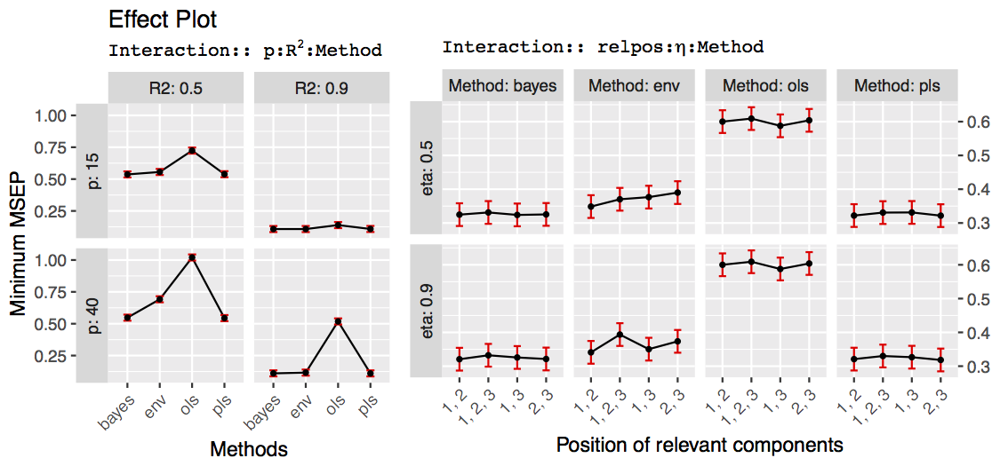
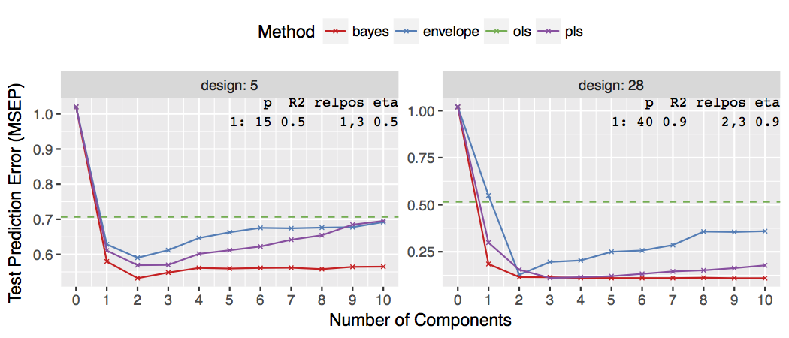

```{r setup, include=FALSE}
knitr::opts_chunk$set(echo = FALSE)
ifnot.beamer <- knitr::opts_knit$get("rmarkdown.pandoc.to") != "beamer"
```

```{r}
library(data.table)
library(ggplot2)
library(simrel)
```


Introduction {data-background=#F6FAF5 .header-slide .center}
=============================================================================

## My PhD Plan {data-background=#FAF7F6 .header-slide}

<div id = "left" class = "fragment">
```{r eval = ifnot.beamer}
knitr::include_graphics("images/phd-plan.svg")
```
</div>
<br>
<div id = "right">
> - Make <span class="fragment highlight-blue">Simulation Tools</span> for multi-response linear model data
> - Using the tool, compare various <span class="fragment highlight-bold">estimation techniques</span> and <span class="fragment highlight-bold">understand</span> them
> - <span class="fragment highlight-bold">Extend</span> the simulation tool incorporating model with <span class="fragment highlight-bold">background information</span>
> - Apply this extended tool to <span class="fragment highlight-blue">test multi-matrix extension of partial least square (PLS)</span> models such as LPLS and UPLS (both uses background information about $X$ and $Y$ for analysis)
</div>

<aside class="notes"  data-markdown="example.md">
### Comment on PLS in short
</aside>

## What I learn {data-background=#FAF7F6 .header-slide}
> - Advanced Multivariate Model and technique to analyze it
> - Programming concept for developing statistical packages and applications for various statistical methods
> - Extending and improving existing methods in statistics
> - And, obviously, to properly document what I have done

## Today's Special {data-background=#FAF7F6 .header-slide}

<div class="fragment">Today I will talk about:</div><br/>

> - Simulation tool (<span class="fragment highlight-blue">`simulatr`</span>) we are building
> - A <span class="fragment highlight-blue">comparative study</span> of various estimation techniques by simulating linear model data using `simulatr`

`simrel-m`: A versatile tool for simulating multi-response linear model data {data-background=#F6FAF5 .header-slide .center}
=============================================================================

## Overview {data-background=#FAF7F6 .header-slide}

. . .

`simrel-M` is an extension of `simrel` [@saebo2015simrel] r-package for simulating multi-response data

<div class = "fragment">

- Uses the idea of reduction of random regression model by separating latent space of $\mathbf{X}$ into subspaces that is relevant and irrelevant for predicting each response
- The underlying concept is based on reparameterizing the population model, 

$$
\mathbf{Y} = \boldsymbol{\mu}_{Y} + \mathbf{B}^t\left(\mathbf{X} - \boldsymbol{\mu}_X\right) + \boldsymbol{\epsilon}
\text{, where }\boldsymbol{\epsilon} \sim N(0, \boldsymbol{\Sigma}_{Y|X})
$$

```{r, eval=ifnot.beamer, out.width="50%"}
knitr::include_graphics("images/reduction-model.svg")
```

</div>


## Underlying procedure {data-background=#FAF7F6 .header-slide}

. . .

<div id = 'left'>

```{r, eval = ifnot.beamer}
knitr::include_graphics("images/simrel-broad-flowchart.svg")
```

</div>

<div id = 'right'>

> - Collect population input parameter from users such as: number of variables, coefficient of determination and the position of relevant components
- Make a covariance matrix satisfying input parameters
- Rotate the covariance matrix orthogonally
- Sample calibration and validation sets

</div>


A comparative study of different estimation methods using simulated data {data-background=#F6FAF5 .header-slide .center}
=============================================================================

## Overview {data-background=#FAF7F6 .header-slide}

##### Four estimtion methods were considered {.fragment}

<br/>
<div class = "fragment">

<div id = "left">

#### Ordinary Least Squares (OLS) {.fragment .highlight-current-mediumgreen}
- Although unbiased, suffer highly from multicollinearity
- Widely used and can be used as reference for comparison


#### Envelope {.fragment .highlight-current-blue}
- Relatively new method [@cook2013envelopes] and is also based on reduction of regression model
- Based on Maximum Likelihood but works better than OLS in $p$ approaches $n$

</div>

<div id = "right">

#### Partial Least Squares (PLS) {.fragment .highlight-current-purple} 
- Well established and widely used method
- Based on Latent Structure and free of multicollinearity problem


#### Bayes PLS {.fragment .highlight-current-red}
- Bayesian Estimation of regression coefficient
- Promising performance was shown in previous studies [@helland2012near]

</div>
</div>

## Simulation Design {data-background=#FAF7F6 .header-slide}

. . .

From the possible combination of following parameter combination, *32* single response calibration sets were simulated with *5* replication of each.

> - **Number of sample observations**: _50_
> - **Number of predictor variables**: _15_ and _40_
> - **Coefficient of determination $(R^2)$**: _0.5_ and _0.9_
> - **Level of multicollinearity**: _0.5_ and _0.9_
> - **Position of relevant components**: _1_ and _2_; _1_ and _3_; _2_ and _3_; _1_, _2_ and _3_

<aside class="notes" data-markdown="example.md">
### Coefficient of determination denotes information level in the simulated dataset
### Lower the value of level of multicollinearity, better (i.e. predictor variables are independent) and also supports assumption of linear model
</aside>

## A Systematic Comparison {data-background=#FAF7F6 .header-slide}
<div class="fragment">

```{r, out.width="60%"}

```
</div>

<div class = "fragment">
<div id = "left">
- Bayes PLS has out-performed others methods in all kinds of data
- Envelope has performed better than OLS in all situations and PLS in some situations
</div>
<div id = "right">
- OLS prediction is very poor in noisy data with many predictor variables
- Position of relvant component and the decaying factor of eigenvalue has less impact on prediction in all the models
</div>
</div>


<aside class="notes" data-markdown="example.md">
### Small prediction error gives good result and is better
</aside>

## A Systematic Comparison {data-background=#FAF7F6 .header-slide data-transition="none"}

<div class="fragment">

```{r, out.width="60%"}

```

</div>

<div class = "fragment">
<div id = "left">
- Bayes PLS has approached to its minimum error with very few component and remained low for additional component
- PLS has moderate performance but better than envelope in many situations.
</div>
<div id = "right">
- OLS prediction is poor especially with large number of predictor
- Envelope method captured its minimum error and the error increased with additional components
</div>
</div>

<aside class="notes"  data-markdown="example.md">
### Number of components are the assumed dimension of relevant x-space
</aside>


Demonstration {data-background=#F6FAF5 .header-slide .center}
=============================================================================

## <a href="https://therimalaya.shinyapps.io/simulatr/">`simulatr` Application</a> {data-background-image='images/simulatr-screenshot.png' data-background-color=#FAF7F6 .header-slide data-background-size='cover' .top #simulatr-link}

# {data-background-image='images/ThankYou.jpg' data-background-size='90% 90%' data-background-color=#fff data-background-size='100% 100%'}

# References {.center}
## References {data-background=#FAF7F6 .header-slide}
