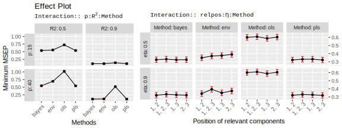

```{r setup, include=FALSE}
knitr::opts_chunk$set(echo = FALSE, message = FALSE, warnings = FALSE)
ifnot.beamer <- knitr::opts_knit$get("rmarkdown.pandoc.to") != "beamer"
```

```{r}
library(data.table)
library(ggplot2)
library(simrel)
```

Introduction {data-background="#F6FAF5"}
=============================================================================

## My PhD Plan ##

<div class="row">
<div class="col-6 fragment">

```{r eval = ifnot.beamer}
knitr::include_graphics("images/phd-plan.svg")
```

</div>
<div class="col-6 fragment">

### Why I am doing this ###

*Important for:* 

> - Research 
> - Education and 
> - Method Evaluation

</div>
</div>

## What I learn ##

> - Advanced Multivariate Model and technique to analyze it
> - Programming concept for developing statistical packages and applications for various statistical methods
> - Extending and improving existing methods in statistics
> - And, obviously, to properly document what I have done

## Today's Special ##

<div class="fragment">Today I will talk about:</div><br/>

> - A <span class="fragment highlight-blue">comparative study</span> of various estimation techniques by simulating linear model data using [`simulatr`](https://therimalaya.shinyapps.io/simulatr/) in single response situation <span class="highlight-red fragment">Demonstration</span>
> - Simulation tool (<span class="fragment highlight-blue">[`simulatr`](https://therimalaya.shinyapps.io/simulatr/)</span>) we are building


A comparative study of different estimation methods using simulated data {data-background="#F6FAF5"}
========================================================================

## Overview {data-transition="slide-in none"}

*Four estimtion methods were considered*

<div class = "row fragment">
<div class = "col-6">

#### Ordinary Least Squares (OLS) ####

- Although **unbiased**, suffer highly from **multicollinearity**
- Widely used and can be used as **reference for comparison**


</div>
<div class = "col-6">

#### Partial Least Squares (PLS) ####

- **Well established** and widely used method
- Based on Latent Structure and **free of multicollinearity problem**


</div>
</div>

## Overview {data-transition="none slide-out"}

*Four estimtion methods were considered*

<div class = "row ">
<div class = "col-6">

#### Envelope ####

- Relatively **new method** [@cook2013envelopes] and is also based on reduction of regression model
- Based on **Maximum Likelihood** but works better than OLS in $p$ approaches $n$

</div>
<div class = "col-6">

#### Bayes PLS ####

- **Bayesian Estimation** of regression coefficient
- **Promising performance** was shown in previous studies [@helland2012near]

</div>
</div>

## Simulation Design ##

. . .

Population Parameters were set as follows:

> - **Number of sample observations**: _50_
> - **Number of predictor variables**: _15_ and _40_
> - **Coefficient of determination $(R^2)$**: _0.5_ and _0.9_
> - **Level of multicollinearity**: _0.5_ and _0.9_
> - **Position of relevant components**: _1_ and _2_; _1_ and _3_; _2_ and _3_; _1_, _2_ and _3_

. . .

From the combination of above parameters, **32** datasets were simulated with **5** replication of each, i.e. **160 datasets** with 5 of them having similar population properties.

## A Systematic Comparison {data-transition="slide-in none"}

```{r, out.width="100%"}

```

<ul>
<li class="fragment current-display">Bayes PLS has out-performed others methods in all kinds of data</li>
<li class="fragment current-display">Envelope has performed better than OLS in all situations and PLS in some situations</li>
<li class="fragment current-display">OLS prediction is very poor in noisy data with many predictor variables</li>
<li class="fragment current-display">Position of relvant component and the decaying factor of eigenvalue has less impact on prediction in all the models</li>
</ul>

## A Systematic Comparison {data-transition="none slide-out"}

```{r, out.width="100%"}
knitr::include_graphics("images/prediction-error-selected.svg")
```

<ul>
<li class="fragment current-display">Bayes PLS has approached to its minimum error with very few component and remained low for additional component</li>
<li class="fragment current-display">PLS has moderate performance but better than envelope in many situations.</li>
<li class="fragment current-display">OLS prediction is poor especially with large number of predictor</li>
<li class="fragment current-display">Envelope method captured its minimum error and the error increased with additional components</li>
</ul>

`simrel-m`: A versatile tool for simulating multi-response linear model data {data-background="#F6FAF5"}
=============================================================================

## `simrel-m` ##

. . .

_It is an extension of `simrel` [@saebo2015simrel] r-package for simulating **multi-response data**_

```{r, eval=ifnot.beamer, out.width="50%"}
knitr::include_graphics("images/reduction-model.svg")
```

<ul>
<li class="fragment current-display">Based on idea of **reduction of random regression model** </li>
<li class="fragment current-display">It separates $X$ into subspaces that is relevant and irrelevant for predicting each response</li>
<li class="fragment current-display">It re-parameterize the population model,
$$
\mathbf{Y} = \boldsymbol{\mu}_{Y} + \mathbf{B}^t\left(\mathbf{X} - \boldsymbol{\mu}_X\right) + \boldsymbol{\epsilon}
\text{, where }\boldsymbol{\epsilon} \sim N(0, \boldsymbol{\Sigma}_{Y|X})
$$
</li>
<li class="fragment current-display">It can simulate diverse nature of data with very few parameters </li>
</ul>


## How it works 

. . .

<div class="row">
<div class="col-6">

```{r, eval = ifnot.beamer}
knitr::include_graphics("images/simrel-broad-flowchart.svg")
```

</div>
<div class="col-6">

> - Collect input parameters from user
> - Make a covariance matrix satisfying those input parameters
> - Computes true population properties such as regression coefficients
> - Sample calibration and validation sets

</div>
</div>

Demonstration {data-background="#F6FAF5"}
=============================================================================

## <a href="https://therimalaya.shinyapps.io/simulatr/">`simulatr` Application</a> {data-background-image='images/simulatr-screenshot.png' data-background-color=#FAF7F6 .header-slide data-background-size='cover' .top #simulatr-link}

# {data-background-image='images/ThankYou.jpg' data-background-size='90% 90%' data-background-color=#fff data-background-size='100% 100%'}
# References {data-background="#117d6b"}
## References
