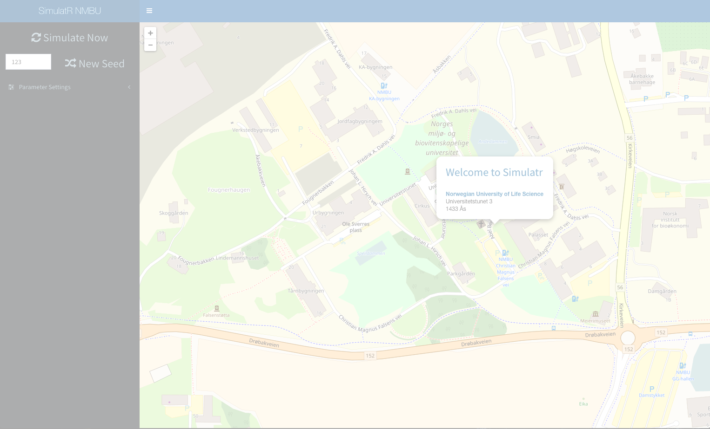

```{r setup, include=FALSE}
knitr::opts_chunk$set(echo = FALSE)
ifnot.beamer <- knitr::opts_knit$get("rmarkdown.pandoc.to") != "beamer"
```

```{r}
library(data.table)
library(ggplot2)
library(simrel)
```


Introduction
=============================================================================

## My PhD Plan 

<div id = "left" class = "fragment">
```{r eval = ifnot.beamer}
knitr::include_graphics("images/phd-plan.svg")
```
</div>
<br>
<div id = "right">
> - Make <span class="fragment highlight-blue">Simulation Tools</span> for multi-response linear model data
> - Using the tool, compare various <span class="fragment highlight-bold">estimation techniques</span> and <span class="fragment highlight-bold">understand</span> them
> - <span class="fragment highlight-bold">Extend</span> the simulation tool incorporating model with <span class="fragment highlight-bold">background information</span>
> - Apply this extended tool to <span class="fragment highlight-blue">test multi-matrix extension of PLS</span> models such as LPLS and UPLS
</div>

## What I learn
> - Advanced Multivariate Model and technique to analyze it
> - Programming concept for developing statistical packages and applications for various statistical methods
> - Extending and improving existing methods in statistics
> - Properly document what I have done

## Today's Special

Today I will talk about:

> - Simulation tool we are building
> - A competative study of different estimation technique by using the data simulated from the tool

`simrel-m`: A versatile tool for simulating multi-response linear model data
=============================================================================

## Overview
> - An extension of `simrel` [@saebo2015simrel] r-package
> - Uses the idea of reduction of random regression model by separating latent space of $\mathbf{X}$ into subspaces that is relevant and irrelevant for predicting each response
> - The underlying concept is based on reparameterizing the population model, 
$$
\mathbf{Y} = \boldsymbol{\mu}_{Y} + \mathbf{B}^t\left(\mathbf{X} - \boldsymbol{\mu}_X\right) + \boldsymbol{\epsilon}
$$
where, $\boldsymbol{\epsilon} \sim N(0, \boldsymbol{\Sigma}_{Y|X})$

## Underlying procedure
<div id = "left">
```{r, eval = ifnot.beamer}
knitr::include_graphics("images/simrel-broad-flowchart.svg")
```
</div>
<div id = "right>

</div>

A comparative study of different estimation methods using simulated data
=============================================================================

## Overview

----

Conclusion
=============================================================================

## Testing
<p class="fragment grow">grow</p>
<p class="fragment shrink">shrink</p>
<p class="fragment fade-out">fade-out</p>
<p class="fragment fade-up">fade-up (also down, left and right!)</p>
<p class="fragment current-visible">visible only once</p>
<p class="fragment highlight-current-blue">blue only once</p>
<p class="fragment highlight-red">highlight-red</p>
<p class="fragment highlight-green">highlight-green</p>
<p class="fragment highlight-blue">highlight-blue</p>

## Simulatr App
<a href = "https://therimalaya.shinyapps.io/simulatr/">
```{r, out.width='80%'}

```
</a>

---

## A java Applet

<APPLET ARCHIVE="~/Desktop/cakefactory.jar" WIDTH=400 HEIGHT=200>
 </APPLET>

----

```{r, fig.align='center', out.width="90%"}
knitr::include_graphics('images/ThankYou.jpg')
```


# References
## References
